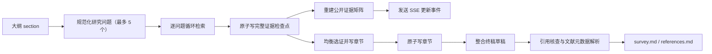
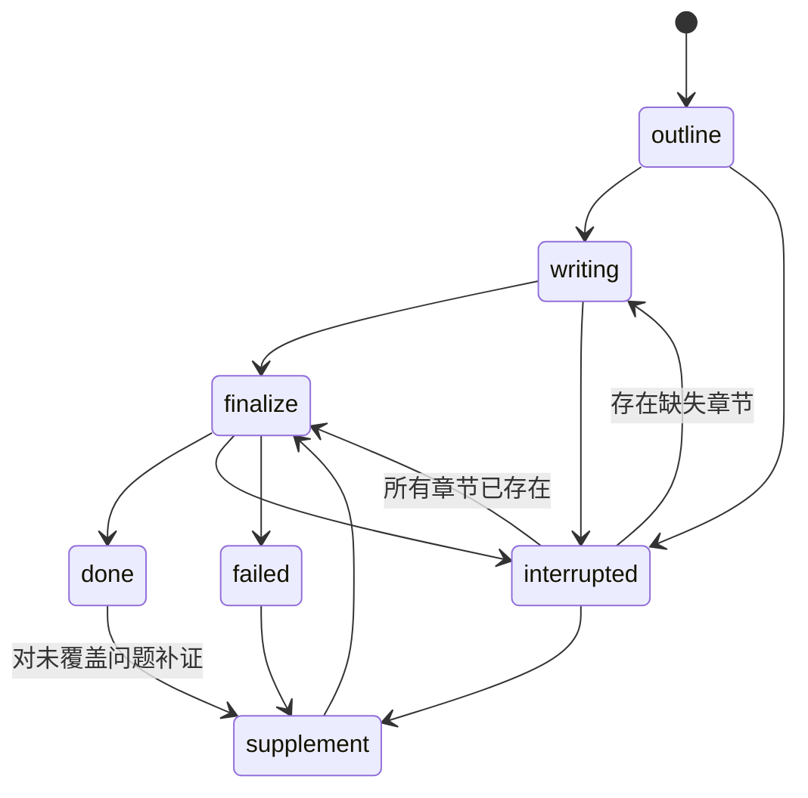

# 综述搜证与检查点架构

本文定义综述任务的事实源、阶段边界、恢复策略和数据暴露边界。目标不是“尽量续跑”，而是让每次恢复都有确定依据，不重复昂贵检索，也不把旧产物误当成新状态。

## 核心原则

1. **充分性按研究问题覆盖判断**：每个研究问题至少需要 2 个证据块、2 个独立来源；全节还需要满足来源多样性。chunk 总数只决定写作上下文容量。
2. **一个概念只有一个事实源**：研究问题列表统一由 `research_questions_for_section()` 生成，检索、检查点校验、公开矩阵和定向补证共用同一口径，当前上限为 5 个。
3. **原始数据和公开投影分离**：恢复所需的完整 chunk 只保存在任务工作区；前端只读取截断摘要。
4. **先落盘，再宣布进度**：每轮检索完成后先原子写检查点和矩阵，再发送更新事件。事件流用于观察和回放，不承担业务事实源职责。
5. **恢复从最后一个完整边界继续**：不从流式文本猜测章节完成状态；终稿只有完整生成后才写入 `finalize_draft.md`。

## 单一事实源

| 数据 | 权威位置 | 用途 |
| --- | --- | --- |
| 任务状态与阶段边界 | `workspace/<task>/task.json` | 列表、恢复决策、硬重启状态判定 |
| 单节完整搜证状态 | `checkpoints/evidence/<section>.json` | 继续下一检索轮、重写章节 |
| 前端证据投影 | `evidence_matrix.json` | 展示覆盖率、来源和缺口 |
| 已完成章节 | `sections/<section>.md` | 跳过重复检索与写作 |
| 完整终稿草稿 | `finalize_draft.md` | 引用核查失败后继续 |
| 最终交付 | `survey.md`、`references.md` | 用户查看与导出 |
| 过程日志 | `events.jsonl` | SSE 回放、诊断和审计 |

`events.jsonl` 不是状态数据库。它只在兼容旧任务时用于恢复已经完整输出、但尚未建立 `finalize_draft.md` 的终稿流。

## 数据流

## 检查点边界

### 大纲

- `outline.md` 已写入；
- `task.json.outline` 已更新；
- `evidence_matrix.json` 已按规范化研究问题初始化；
- `checkpoint = {phase: "outline", status: "completed"}`。

### 单轮搜证

每轮必须原子保存：

- 规范化研究问题列表；
- 各问题的完整证据组；
- 已使用查询；
- 当前轮次和最大轮次；
- 覆盖评估与状态 `retrieving | ready | partial`。

只有上述内容成功落盘后，才发出 `evidence_matrix_updated` 和 `deep_round`。

### 章节完成

- `sections/<id>.md` 已原子写入；
- 对应证据检查点标记为 `written`；
- `completed_sections` 和任务检查点已更新。

章节文件与 `written` 检查点同时存在时，恢复过程跳过该节。

### 终稿

- 长文本整合完整返回后，原子写 `finalize_draft.md`；
- 引用核查可以独立重试；
- 章节发生重写前，旧终稿移动到 `checkpoints/archive/`，禁止复用。

## 状态机与恢复优先级

恢复决策：

1. 大纲不存在：不能越过规划阶段自动恢复，返回明确冲突。
2. 任一章节文件缺失：进入 `writing`；先归档旧 `finalize_draft.md`。
3. 所有章节存在：进入 `finalize`；可复用完整终稿检查点。
4. 定向补证：只追加目标问题的证据，只重写目标章节，再重新整合终稿。
5. 服务硬重启：磁盘仍标记 `running`、但进程内不存在活动任务时，API 对外报告 `interrupted`；详情页在事件回放结束后读取该权威快照。

## 原始检查点与公开矩阵边界

完整检查点包含 chunk 正文，属于内部恢复数据，不直接提供给浏览器。

公开矩阵只包含：

- chunk id；
- 来源文件；
- 分数；
- 最多 180 字预览；
- 每问题证据数、来源数、覆盖状态；
- 章节和全局汇总。

该边界同时降低前端载荷，并避免通过普通详情接口暴露整段知识库内容。

## 原子性与故障模型

- `task.json`、证据检查点、证据矩阵、章节和终稿检查点采用同目录临时文件 + `os.replace`。
- 进程在替换前退出时，旧文件仍然完整；替换后退出时，新文件完整可见。
- `events.jsonl` 是追加日志，允许最后一帧缺失；恢复不依赖日志尾部表示业务完成。
- 归档采用工作区内原子移动，保留旧终稿便于审计，不做不可恢复删除。

## 必须保持的架构约束

- 不得在前端、提示词或新模块中复制研究问题上限和规范化逻辑。
- 不得用章节 chunk 总数替代逐问题覆盖判定。
- 不得把 `evidence_matrix.json` 反向用于恢复写作。
- 不得在章节重写后继续使用旧 `finalize_draft.md`。
- 不得仅凭最后一条 SSE 事件判断硬重启后的任务状态。
- 新增检查点字段时必须提升 schema 版本或提供兼容读取逻辑。

